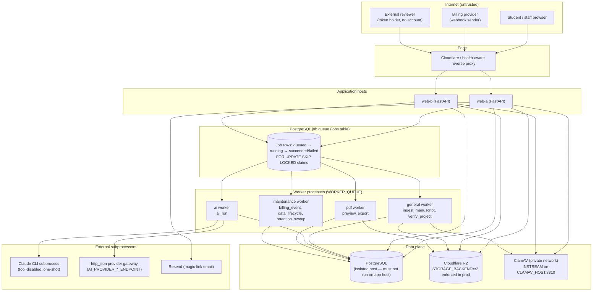
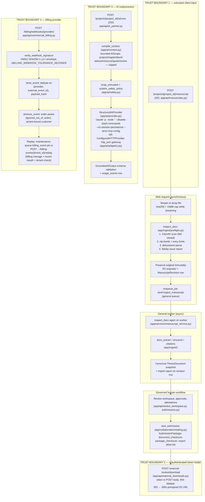
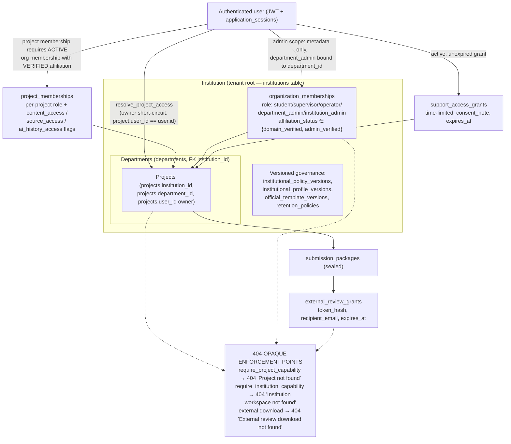

# Security Architecture — Robofox Thesis Studio

**Status:** Review-preparation document for an external security review. It describes the system as implemented in this repository and the production topology defined in `docs/phase5/production-topology.md`. It is not a compliance claim; see `docs/phase5/security-verification-matrix.md` for the evidence matrix and the external work still required.

The codebase is a FastAPI modular monolith (`app/main.py`, `create_app()`). Runtime processes are split into separate failure domains: two web instances behind health-aware routing, and dedicated worker processes fed by a durable PostgreSQL job queue (`app/services/job_queue.py`). Every diagram below is traceable to code paths cited in the prose.

---

## 1. System architecture

### Notes for reviewers

- **Web tier.** `create_app()` in `app/main.py` installs three middlewares in order: `JourneyTracingMiddleware` (request/trace/release IDs, `app/commercial/observability.py`), `CommercialGuardMiddleware` (server-side entitlement enforcement, `app/commercial/guards.py`), and `CORSMiddleware` restricted to `settings.cors_origins_list` (`CORS_ORIGINS` in `app/core/config.py`). OpenAPI docs are disabled outside `DEBUG` (`docs_url="/docs" if settings.DEBUG else None`); `DEBUG=true` is rejected in production by the `production_safety` model validator in `app/core/config.py`.
- **Production hard gates.** The `Settings.production_safety` validator (`app/core/config.py`) refuses to boot production with: `DEBUG=true`, `STORAGE_BACKEND != "r2"` (when `PRODUCTION_REQUIRE_R2`), missing or placeholder R2 credentials, missing `RELEASE_SHA`, non-positive session lifetimes, or `MALWARE_SCAN_MODE != "clamav"` (when `PRODUCTION_REQUIRE_MALWARE_SCAN`). These make the local-storage and scan-disabled development fallbacks unreachable in production.
- **Job queue.** `app/services/job_queue.py` routes job kinds to queues via `_QUEUE_BY_KIND`: `ingest_manuscript`/`verify_project` → `general`, `ai_run` → `ai`, `preview`/`export` → `pdf`, `billing_event`/`data_lifecycle`/`retention_sweep` → `maintenance`. Claims use `SELECT ... FOR UPDATE SKIP LOCKED` (`_claim_next`); workers hold expiring leases (`JOB_LEASE_SECONDS=120`) renewed by heartbeat (`JOB_HEARTBEAT_SECONDS=20`); expired leases are recovered for idempotent retry (`_recover_expired_leases`, and `recover_stale_jobs()` on startup in `app/main.py` lifespan). `enqueue_job` deduplicates on `idempotency_key`, and `_already_completed` short-circuits re-dispatch of finished work. This satisfies production-topology boundary 7 (expiring leases + idempotent operation identifiers).
- **Failure isolation.** Per `docs/phase5/production-topology.md`: ClamAV outage fails new uploads with 503 (`MalwareScannerUnavailableError` handler in `app/core/exceptions.py`) while editing/review/export stay available; AI provider failure is isolated behind a circuit breaker (`AI_PROVIDER_FAILURE_THRESHOLD=5`, `AI_CIRCUIT_COOLDOWN_SECONDS=300` in `app/core/config.py`) so `/healthz` reports the AI component separately.
- **Health surface.** `/healthz` (liveness + release identity) and `/readyz` (503 unless `readiness_report()` is ready) in `app/main.py`.

---

## 2. Data-flow diagram

Trust boundaries are drawn where data crosses from an untrusted origin into the system, or leaves the system for a subprocessor.

### Manuscript pipeline (upload → scan → parse → canonical → review → seal → external download)

1. **Upload.** `POST /projects/{project_id}/manuscript` (`app/api/manuscripts.py`) requires an owned project (`fetch_owned_project`), sanitises the filename (`_safe_filename`), enforces `.docx` extension and MIME allow-list (422 otherwise), and streams to a temp file with a running SHA-256 and a hard 413 at `MAX_UPLOAD_BYTES` (15 MB, `app/ingest/preflight.py`).
2. **Scan + preflight (synchronous, fail-closed).** `inspect_docx(temp_path)` runs *in the upload request* (`app/api/manuscripts.py:118`). Its first action is `scan_file_sync` (`app/services/malware_service.py`) — ClamAV `INSTREAM` over the private network; malware → 422 rejection via the `MalwareDetectedError` handler, scanner outage → fail-closed 503 via `MalwareScannerUnavailableError` (`app/core/exceptions.py`). Only then do the zip-structure checks and `defusedxml` parsing run. Validation failures surface as 422 with no scanner internals.
3. **Preserve + enqueue.** The original is stored immutably (durable `originals/` prefix per the production topology), a `ManuscriptRevision` row is written (duplicate checksums are 409-blocked unless `force_duplicate`), and an `ingest_manuscript` job is enqueued on the `general` queue.
4. **Parse on the worker.** `ingest_revision` (`app/services/manuscript_service.py`) re-runs `inspect_docx` on the worker's copy (defence in depth against a stored object diverging from what was scanned), then extracts structure and citations (`app/ingest/docx_extract.py`, `structure.py`, `citations.py`) into the canonical `ThesisDocument` snapshot with an import report.
5. **Review.** Humans operate through capability-gated routes (`app/collaboration/capabilities.py`); AI can only propose, never mutate (see boundary 3 notes below).
6. **Seal.** `seal_submission` (`app/collaboration/sealing.py`) creates a `SubmissionPackage` (`app/models/institutional_governance.py`) pinning `snapshot_id` (FK `ondelete="RESTRICT"`), `document_version`, `document_checksum` (SHA-256 of the snapshot), an explicit `export_ids` allow-list, and a `package_checksum` over the manifest.
7. **External download.** `POST /external-review/download` (`app/api/external_downloads.py`) is the only unauthenticated content path: token accepted only in the POST body (never a URL), matched by SHA-256 `token_hash` against an active, unexpired `ExternalReviewGrant`, recipient email compared with `secrets.compare_digest`, `download_allowed` + `sealed.download` permission required, the package must still be `sealed`, and the export must be in the package's `export_ids` allow-list with a checksum and `manifest.state == "final"`. Every failure mode returns the same opaque 404. Success is a 303 redirect to a 300-second presigned R2 URL, with `access_count`/`last_accessed_at` recorded.

### AI request flow

`POST /projects/{project_id}/ai/runs` returns 202 and enqueues an `ai_run` job on the `ai` queue; `execute_ai_job` (`app/commercial/ai_execution.py`) drives the orchestrator (`app/ai/orchestrator.py`). What leaves the boundary is decided by `compile_context` (`app/ai/context.py`): a bounded `AIScope` (project outline / one chapter / named blocks / one source / one quote / one review item), safe project metadata (`_safe_project_meta`), and token-budget clipping (`_clip`) — not an automatic whole-thesis dump (matrix row "AI data minimisation" in `docs/phase5/security-verification-matrix.md`). All document-derived text is XML-escaped and wrapped in `<untrusted_content>` labels (`wrap_untrusted`, `app/ai/safety.py`) under `system_safety_policy()` authority rules. Execution is either the tool-disabled one-shot Claude CLI subprocess (`app/ai/provider.py`: `--tools ""`, `--disable-slash-commands`, `--no-session-persistence`, `--strict-mcp-config` with an empty MCP config, `cwd=` temp dir, 600 s timeout) or the `http_json` gateway adapter (`app/ai/adapters.py`, credential references restricted to `env:`/`file:`). Output must validate as `GroundedAIOutput` (`app/ai/schemas.py`); every call records a `usage_events` row.

### Billing webhook flow

`POST /billing/webhooks/{provider}` (`app/api/commercial_billing.py`) → `ingest_webhook` (`app/commercial/billing.py`): HMAC-SHA256 signature over `t.<raw_body>` in the `t=,v1=` envelope, constant-time compare, timestamp within `BILLING_WEBHOOK_TOLERANCE_SECONDS` (300 s default), fail-closed if `BILLING_WEBHOOK_SECRET` is unset. Events are stored once per `(provider, external_event_id)` with a `payload_hash`, processed order-aware (`ignored_out_of_order` for stale subscription events), and are replayable either via the maintenance queue (`billing_event` job kind) or the admin route `POST /institutions/{institution_id}/commercial/billing-events/{event_id}/replay`, which requires the `billing.manage` capability, recent reauthentication, and an institution-binding check before touching the event.

---

## 3. Tenant boundary

### How the boundary is enforced

- **Single resolution point.** `resolve_project_access` (`app/collaboration/capabilities.py`) is the only path from a user to project capabilities. Order of resolution: owner (full `STUDENT_CAPABILITIES`), then active `ProjectMembership` — which is only honoured when the user *also* holds an active `OrganizationMembership` in the project's institution with `affiliation_status` in `{domain_verified, admin_verified}` (`_VERIFIED_AFFILIATIONS`) — then department/institution admins (metadata scope only: `content_access=False`, `source_access=False`, `ai_history_access=False`), then a live `SupportAccessGrant` (`expires_at > now`). Anything else resolves to `None`.
- **404, never 403.** `require_project_capability` raises `HTTP 404 "Project not found"` both when access resolves to `None` *and* when the capability is missing, so cross-tenant probing cannot distinguish "doesn't exist" from "not yours". `require_institution_capability` does the same with `404 "Institution workspace not found"`, including for department-scope mismatches. The external-review endpoint returns the identical 404 for bad token, wrong email, missing permission, revoked grant, unsealed package, and missing export (`app/api/external_downloads.py`).
- **Membership de-escalation.** `ProjectMembership` rows carry explicit `content_access`/`source_access`/`ai_history_access` booleans (`app/models/tenancy.py`); when false, `resolve_project_access` strips the corresponding read *and* edit capabilities even if the role would normally grant them.
- **Department scoping.** `department_admin` org memberships only reach projects in their own `department_id` (checked in both `resolve_project_access` and `accessible_project_ids`; a department admin without a department gets nothing).
- **Listing parity.** `accessible_project_ids` builds indexes from the same three sources (ownership, active memberships, admin scope) and its docstring commits that every project response is still re-resolved through `resolve_project_access` — list endpoints cannot leak more than item endpoints.
- **Billing is tenant-bound.** `BillingCustomer` rows must bind to an institution or user at creation (`_customer` in `app/commercial/billing.py`), and the replay route 404s when the event's institution doesn't match the URL institution (`_billing_event_institution_id` check in `app/api/commercial_billing.py`).
- **Evidence.** `tests/test_isolation.py` (cross-user session access returns 404, invalid JWT returns 401), `tests/test_phase5_tenant_isolation.py` (`test_institution_cannot_replay_another_tenants_billing_event`, `test_sealed_submission_blocks_destructive_project_deletion`), `tests/test_phase4_sealed_guard.py`, and the adversarial log in `tests/ADVERSARIAL_TEST_EVIDENCE.md`. Per `docs/phase5/production-topology.md`, an acknowledged cross-tenant disclosure is zero-tolerance SEV-1.

### Open items for the reviewer

These are the areas where the code intends a control but independent verification is still required (mirrors "Required external work" in `docs/phase5/security-verification-matrix.md`): production cookie flags on the session cookie (`SESSION_COOKIE_NAME`), Cloudflare/R2/ClamAV network and IAM boundaries, rate limiting/WAF in front of the unauthenticated `POST /external-review/download` and `POST /billing/webhooks/{provider}` routes, and an independent tenant-isolation penetration test.
