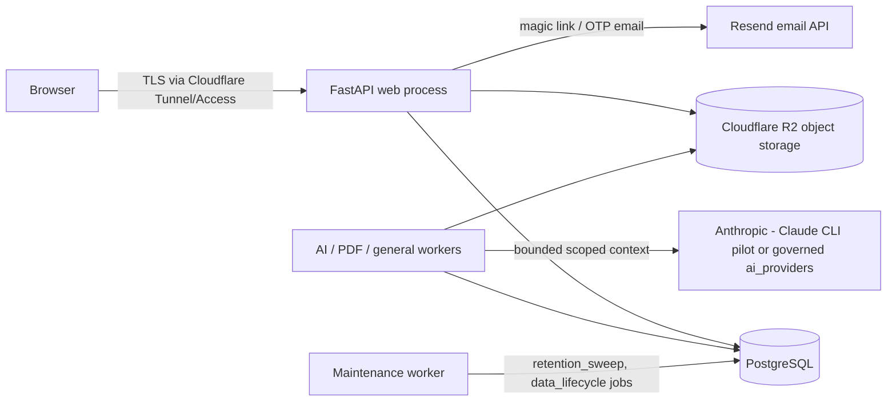

# Data Inventory — Review Preparation

Status: **review-preparation document**. This inventory was compiled from the actual codebase to prepare for an external security and privacy review. It is not a compliance attestation and makes no ASVS, SOC 2, ISO, or DPDP conformance claim. The runtime registry counterpart is the `data_inventory_records` table (`app/models/commercial.py`, class `DataInventoryRecord`), which should be seeded from this document once reviewed.

Companion documents: `docs/phase5/data-map.md` (operational data map), `docs/security/RETENTION_AND_DELETION.md`, `docs/security/SUBPROCESSORS.md`, `docs/security/LOGGING_REDACTION.md`.

## Storage systems in scope

Sources: `docs/phase5/production-topology.md` (logical topology), `SETUP-CLOUDFLARE-TUNNEL.md` (ingress), `app/services/job_queue.py:35` (queue routing).

## Encryption state — summary and honesty notes

PostgreSQL rows are stored without application-level (column) encryption; at-rest encryption is the hosting provider's block-volume encryption and has not been independently verified for this deployment. Cloudflare R2 applies provider-managed at-rest encryption by default; no customer-managed keys are configured (`R2_*` settings, `app/core/config.py:74-78`). Transport into the platform is TLS terminated at Cloudflare (Tunnel ingress, `SETUP-CLOUDFLARE-TUNNEL.md`); TLS enforcement on the app-to-PostgreSQL link (`DATABASE_URL`, `app/core/config.py:30`) is an open verification item for the review. Backups must be recorded as encrypted (`backup_records.encrypted`, non-nullable Boolean, `app/models/commercial.py:665`) and only count after checksum-verified restore drills (`restore_drills`, `app/models/commercial.py:679-697`; `PHASE5-COMMERCIAL-OPERATING-CONTRACT.md`, "Backups count only after checksum-preserving restore drills pass").

Secrets and tokens are stored only as hashes where the platform issues them: SHA-256 in `auth_tokens.token_hash` (`app/models/auth_token.py:42`), `application_sessions.token_hash` (`app/commercial/sessions.py:30-31`), `membership_invitations.token_hash` (`app/models/tenancy.py:128`), `external_review_grants.token_hash` (`app/models/institutional_governance.py:204`), and `billing_customers.billing_email_hash` (`app/models/commercial.py:198`).

## Access-role vocabulary used below

- **Student owner** — `projects.user_id`; owns manuscript content and private AI history.
- **Project member** — `project_memberships` row with explicit booleans `content_access`, `source_access`, `ai_history_access` (`app/models/tenancy.py:89-91`). Membership without these flags is metadata-level.
- **Institution admin** — governs policy/profile versions; content access defaults off (`institutions.workspace_settings.admin_content_access_default: False`, `app/models/institution.py:39-47`).
- **Supervisor/reviewer** — snapshot-bound review records; AI-history visibility defaults off (`projects.collaboration_policy.supervisor_ai_history_default: False`, `app/models/project.py:97-107`).
- **Support** — metadata-only by default; content access requires a time-limited `support_access_grants` row with consent note (`app/models/tenancy.py:262-282`) and is audited in `support_actions` (`app/models/commercial.py:829-852`). See `docs/runbooks/support-operations.md`.
- **External reviewer** — sealed-package access bound to recipient email, hashed token, expiry, and explicit `download_allowed` (`external_review_grants`, `app/models/institutional_governance.py:196-223`).
- **Platform operator** — host/DB shell access; currently the founder. Direct-DB bypass of billing/retention controls is prohibited by runbook (`docs/runbooks/support-operations.md`, "Actions support must not perform by default").

## Inventory table

| # | Data class | Representative fields | Stored where (table / prefix) | Sensitivity | Encryption state | Who can access (role capability) |
|---|---|---|---|---|---|---|
| 1 | Student identity | `email`, `full_name`, `register_number`, `identity_provider`, `last_login_at` | `users` (`app/models/user.py`) | High — direct identifiers incl. academic registration number | DB at-rest only; no column encryption | User (self); institution admins see membership-scoped identity; support via authorized lookup ("Find an account by exact identity", `docs/runbooks/support-operations.md`); platform operator |
| 2 | Sign-in secrets | Magic-link / OTP token hashes, expiry, attempts | `auth_tokens` (`app/models/auth_token.py`) — raw token only in the email, never stored | High | SHA-256 hash at rest; raw value transits Resend (see SUBPROCESSORS) | System only; no read API |
| 3 | Device session records | `token_hash`, `device_label`, `user_agent_hash`, `ip_prefix_hash`, expiry/revocation fields | `application_sessions` (`app/models/commercial.py:381-407`) | Medium — hashed fingerprints, no raw IP/UA | Token SHA-256; UA and IP-prefix hashed with pepper (`app/commercial/sessions.py:34-52`) | User (own devices); support may revoke sessions (runbook); platform operator |
| 4 | Institutional membership and roles | role, affiliation status, capability overrides, invitation email + token hash | `organization_memberships`, `project_memberships`, `membership_invitations`, `departments` (`app/models/tenancy.py`) | Medium — reveals academic affiliation | DB at-rest only | Institution admins within tenant; the member; support (metadata); platform operator |
| 5 | Manuscript prose (canonical) | `meta`, `front_matter`, `chapters`, `works_cited` JSONB; snapshots' full `canonical_document`; parsed `canonical_snapshot` per upload | `projects` (`app/models/project.py:90-93`), `document_snapshots.canonical_document` (`app/models/document_snapshot.py:41`), `manuscript_revisions.canonical_snapshot` (`app/models/manuscript_revision.py:40`) | Very high — unpublished academic work | DB at-rest only | Student owner; project members with `content_access=True`; **not** support by default (enforced: `test_support_diagnostic_never_contains_thesis_text`, `tests/test_phase5_reliability.py:113`) |
| 6 | Manuscript originals (binary) | Uploaded `.docx`, checksum, filename | R2 key `manuscripts/{user_id}/{project_id}/{revision_id}/original.docx` (`app/api/manuscripts.py:154`); metadata in `manuscript_revisions` | Very high | R2 provider-managed at-rest encryption | Student owner via authenticated download (`GET /revisions/{revision_id}/original`, `app/api/manuscripts.py:272`); members with content access; platform operator via R2 credentials |
| 7 | Sources and quotations | `sources.raw_entry`, `sources.fields`; `quotes.text`, `quotes.evidence_snapshot` | `sources`, `quotes` (`app/models/source.py`, `app/models/quote.py`) | High — verbatim quoted material and research trail | DB at-rest only | Student owner; members with `source_access=True` (`app/models/tenancy.py:90`); excluded from support bundles (`app/commercial/support.py:137`) |
| 8 | Review and approval content | `collaboration_comments.body` + `selected_text_snapshot`, `human_suggestions.before_block`/`proposed_operation`, `review_cycles.decision_note`, `supervisor_instructions.text`, `approval_records.note`, `attestations.statement_text` | tables in `app/models/review_collaboration.py` | High — contains manuscript excerpts and academic judgments | DB at-rest only | Project members per comment `visibility` (default `project_members`); reviewer/approver; sealed/audit obligations may bar deletion |
| 9 | Private AI conversation (prompts and outputs) | `ai_messages.content`, `structured`, `scope`, `context_manifest`; thread titles; `ai_memories.content`; `ai_proposals.rationale`/`operations`/`evidence`; legacy `messages.content` | `ai_threads`, `ai_messages`, `ai_runs`, `ai_memories`, `ai_proposals` (`app/models/ai_*.py`); legacy `sessions` + `messages` (`app/models/session.py`, `app/models/message.py`) | Very high — thesis content plus the student's private working process | DB at-rest only; content also transits the AI provider for the bounded request (`docs/phase5/data-map.md` row "Private AI conversation") | Student owner (`ai_threads.private=True` default); members only with `ai_history_access=True`; supervisor default off; support sees run **counts** only (`app/commercial/support.py:44-47`) |
| 10 | AI provenance / context manifests | `ai_runs.context_manifest`, `context_hash`, prompt name/version, provider slug | `ai_runs`, `ai_messages` (`app/models/ai_run.py:47-48`) | Medium — describes what was sent, not full content | DB at-rest only | Authorized audit roles per data map; support (metadata) |
| 11 | AI usage and cost metadata | tokens, model, `estimated_cost_usd`; usage/cost ledgers with quantities and units | `usage_events` (`app/models/usage_event.py`), `usage_ledger`, `cost_ledger` (`app/models/commercial.py:128-183`) | Low-medium — identifiers and quantities, no content ("content is not stored in cost ledger", `docs/phase5/data-map.md`) | DB at-rest only | Finance/operations; institution admins for own tenant |
| 12 | Previews / rebuildable artifacts | Rendered preview objects, page counts, checksums | R2 prefix `previews/{user_id}/{project_id}/…` (`app/services/preview_service.py:157`); `document_previews` metadata | High while present (renders full thesis) but rebuildable | R2 provider-managed | Student owner and content-access members; short retention (30-day default, see RETENTION_AND_DELETION) |
| 13 | Exports and legacy compiled files | Rendered `.docx`/`.pdf`/`.md`/`.txt`, checksum, manifest | R2 `exports/{user_id}/{project_id}/{export_id}.{fmt}` (`app/services/export_service.py:217`) and legacy `files/{user_id}/{session_id}/{file_id}.docx` (`app/services/compile_service.py:261`); metadata in `exports`, `files` | Very high — the finished thesis | R2 provider-managed | Owner via signed download URL; external recipients only through grants (row 15) |
| 14 | Sealed submission packages | `document_checksum`, `package_checksum`, manifest, referenced export/approval IDs | `submission_packages` (`app/models/institutional_governance.py:147-193`) + referenced R2 export objects | Very high + custody obligations | DB/R2 as above; checksummed for chain of custody | Sealing user, institution roles; deletion requires institutional authorization (see RETENTION_AND_DELETION) |
| 15 | External review grants | `recipient_email`, `token_hash`, permissions, watermark, access counts | `external_review_grants` (`app/models/institutional_governance.py:196-223`) | Medium — third-party email plus access trail | Token hashed; email plaintext | Grant creator, institution roles; the recipient exercises (not reads) the grant |
| 16 | Billing / entitlement records | `billing_customers` (`billing_email_hash`, external IDs), `subscriptions`, `invoices`, `payments`, `billing_events.payload` (full webhook JSONB, signature-verified), `entitlement_grants` (reason, actor) | tables in `app/models/commercial.py:186-330`, `91-125` | Medium-high — commercial relationship; payload excludes card data (`docs/phase5/data-map.md` row "Billing webhook payload") but is retained verbatim | DB at-rest; billing email stored as hash | Finance/operations; institution admin for own tenant; billing provider holds the source records |
| 17 | Audit trails | `events` (append-only, `app/models/event.py`), `support_actions` (justification, `content_accessed` flag), `data_lifecycle_requests`/`_jobs` evidence | PostgreSQL | Medium — must stay non-content by convention (deletion events store `project_id_hash`, `app/commercial/privacy.py:188-203`) | DB at-rest only | Authorized audit roles; support reads own actions; retained through deletion for honesty |
| 18 | Consent and privacy-notice records | `consent_records` (decision, purpose, evidence), `privacy_notice_versions` | `app/models/commercial.py:700-744` | Medium | DB at-rest only | User (own consents); privacy owner |
| 19 | Operational logs | Route template, status, duration, `client_hash`, request/trace IDs — no bodies, emails, or prose | Process stdout → host logging (see LOGGING_REDACTION) | Low by design | Host disk; not independently verified | Operations/security staff with host access |
| 20 | Backups | Mirrors classes 1-18 | Encrypted off-host backup per `recovery_policies` / `backup_records` | Inherits highest class mirrored | `encrypted` flag required (`app/models/commercial.py:665`) | Platform operator; restore drills into isolated environments only |

## Known gaps for the reviewer

1. Storage prefix naming in code (`manuscripts/`, `previews/`, `exports/`, `files/`) does not yet match the durable/rebuildable prefix table in `docs/phase5/production-topology.md` (`originals/`, `revisions/`, `sealed/`, `temp/`). The mapping above reflects the code; the topology table reflects intent. Reconcile before prefix-scoped R2 lifecycle rules are published.
2. No `sealed/` object prefix exists yet; sealed packages reference export objects by ID (`submission_packages.export_ids`). Custody therefore depends on export-object retention.
3. Column-level encryption is absent everywhere; the review should assess whether register numbers (`users.register_number`) or quotations warrant it.
4. `data_inventory_records` and `subprocessor_records` tables exist but seeding them from this document has not been done.
