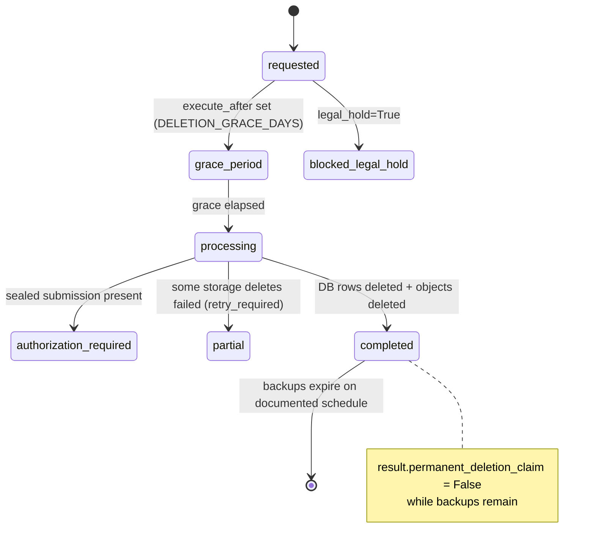

# Retention and Deletion Map — Review Preparation

Status: **review-preparation document** for an external security/privacy review. It describes what the code does today and where policy decisions are still open. It is not a compliance attestation and does not claim DPDP or any other regulatory conformance.

Governing principles (implemented, not merely aspirational):

- "Deletion is a lifecycle with auditable stages, not an instant UI claim" and "Durable artifacts and rebuildable artifacts have separate retention classes" — `PHASE5-COMMERCIAL-OPERATING-CONTRACT.md`, Non-negotiable boundaries.
- "'Permanently deleted' must not be shown while encrypted backups remain within their documented expiry period" — `docs/phase5/data-map.md`, Deletion terminology.

## Durable vs rebuildable classes

The normative split lives in `docs/phase5/production-topology.md` ("Durable versus rebuildable storage") and is modeled per tenant in `recovery_policies.durable` (`app/models/commercial.py:632-653`).

| Class | Members (evidence) | Durability | Loss consequence |
|---|---|---|---|
| Durable | Manuscript originals (`manuscripts/…` keys, `app/api/manuscripts.py:154`; `manuscript_revisions`), canonical document + snapshots (`projects`, `document_snapshots`), sources/quotes, sealed submission packages (`submission_packages`), final exports, billing/audit records | Backed up; restore drills must reproduce checksums (`restore_drills.expected_checksum`/`restored_checksum`, `app/models/commercial.py:688-689`; `test_restore_drill_requires_matching_checksum`, `tests/test_phase5_reliability.py:60`) | Data loss — unacceptable without documented recovery |
| Rebuildable | Previews (`previews/…`, `app/services/preview_service.py:157`; `document_previews`), temp/PDF conversion artifacts, incomplete multipart uploads, ClamAV signature DB | Regenerated from canonical state | Recompute cost only |
| Mixed | `exports/…` — final/sealed exports durable, draft exports policy-driven (`docs/phase5/production-topology.md` prefix table) | Split by state | Draft loss acceptable per policy; final loss is not |

## Retention values as implemented

Per-institution retention is a published, versioned `retention_policies.policy` JSONB (`app/models/institutional_governance.py:125-144`). Where no published policy exists, the code falls back to defaults in `app/commercial/privacy.py:52-59`:

| Policy key | Default | Applies to |
|---|---|---|
| `draft_retention_days` | 365 | Draft project material |
| `ai_chat_retention_days` | 180 | `ai_threads`/`ai_messages` (sweep deletes messages of threads older than this, `app/commercial/privacy.py:325-330`) |
| `preview_retention_days` | 30 | `document_previews` + R2 preview objects (`app/commercial/privacy.py:305-324`) |
| `sealed_submission_retention` | `"contract"` | Sealed packages — contract-governed, never swept (`sealed_submissions_untouched: True`, `app/commercial/privacy.py:336`) |
| `deletion_grace_days` | `DELETION_GRACE_DAYS = 30` (`app/core/config.py:87`) | Grace window before destructive execution |
| `backup_expiry_days` | 90 | Honest backup-expiry statement after deletion |

Related lifetimes in `app/core/config.py`: sessions idle 720 min / absolute 30 days / reauth window 15 min (lines 36-38), magic links 15 min (line 35), billing grace 7 days (line 65).

Sweeps run as `retention_sweep` jobs on the `maintenance` queue (`app/services/job_queue.py:35, 253-258` → `execute_retention_sweep`, `app/commercial/privacy.py:291-337`).

## Staged deletion lifecycle

Requests are rows in `data_lifecycle_requests` (`app/models/tenancy.py:239-259`, with `request_type`, `status`, `legal_hold`, `execute_after`); execution stages are recorded in `data_lifecycle_jobs` (`app/models/commercial.py:855-877`, with `storage_references_hash`, `deleted_count`, `backup_expiry_note`). Executor: `execute_lifecycle_job` (`app/commercial/privacy.py:92-288`), dispatched as `data_lifecycle` jobs (`app/services/job_queue.py:253-256`).

Stage semantics, with evidence:

1. **Grace period** — `execute_after > now` raises `LifecycleBlocked("Deletion grace period has not elapsed.")` (`app/commercial/privacy.py:105-106`).
2. **Legal/administrative hold** — `legal_hold=True` short-circuits to `blocked_legal_hold` (`app/commercial/privacy.py:100-104`), matching the data map's "deletion blocked by sealed custody or legal/administrative hold".
3. **Access removal before destruction** — project deletion first sets `archived=True`, `ai_enabled=False` (`app/commercial/privacy.py:156-158`).
4. **Sealed custody gate** — a sealed `submission_packages` row forces `authorization_required` with `permanent_deletion_claim: False` and an audit `Event` carrying only a hashed package ID (`app/commercial/privacy.py:122-154`).
5. **Storage deletion with evidence** — object keys are collected (`_project_storage_keys`: originals, previews, exports; `app/commercial/privacy.py:62-74`), deleted individually, and evidenced as hashed keys with per-object state (`_delete_keys`, lines 77-89). Failures yield `status="partial"` with `retry_required: True` (lines 182-186).
6. **Honest completion record** — the project row is deleted, but an `Event` of kind `project_deletion_completed` remains with `project_id_hash`, object count, and `backup_expiry_days` (`app/commercial/privacy.py:188-207`).
7. **Account deletion is anonymization, not erasure-with-amnesia** — sessions revoked, memberships revoked, private AI threads/messages hard-deleted, then `email` replaced with `deleted-<sha256-prefix>@invalid.local` and `full_name`/`register_number` nulled (`app/commercial/privacy.py:244-265`). Institutional workflow records are "retained without active account access" (result payload, lines 268-275). Sealed submissions block account erasure but suspend access immediately (lines 226-243).

Verified by test: `test_draft_deletion_removes_active_project_but_keeps_honest_audit` (`tests/test_phase5_reliability.py:140-179`) asserts `result["active_database"] == "deleted"`, `result["permanent_deletion_claim"] is False`, and that the project row is gone — i.e., the draft-deletion path both destroys active data and refuses to over-claim.

## Backup expiry interaction — the "permanently deleted" rule

Active deletion never equals permanent deletion while encrypted backups exist. This is enforced in three places: the operating contract boundary ("Deletion is a lifecycle with auditable stages", `PHASE5-COMMERCIAL-OPERATING-CONTRACT.md`), the data map rule ("'Permanently deleted' must not be shown while encrypted backups remain within their documented expiry period", `docs/phase5/data-map.md:46`), and code — every completion payload sets `permanent_deletion_claim: False` and states `"backups": "scheduled to expire within {N} days"` (`app/commercial/privacy.py:208-214, 268-275`), and each `data_lifecycle_jobs` row carries a `backup_expiry_note` (lines 178-180). `backup_records.expires_at` (`app/models/commercial.py:670`) is the schedule anchor; only after the last covering backup expires may the product describe data as permanently deleted.

## Per-class retention owner and deletion path

Owner names below follow the ownership roles in `docs/phase5/security-verification-matrix.md`. In the current single-operator reality, all roles resolve to the founder; the review should treat "owner" as an accountability slot to be staffed, not an existing team.

| Data class | Active-system deletion path | Retention authority | Owner (role) |
|---|---|---|---|
| Identity (`users`) | Account lifecycle anonymization (`app/commercial/privacy.py:244-277`) | Account/contract lifecycle | Privacy owner |
| Device sessions (`application_sessions`) | Revocation + idle/absolute expiry timestamps (`app/models/commercial.py:396-397`) | Session lifetime + short audit period | Security owner |
| Manuscript originals / canonical / snapshots | Project lifecycle job (grace → storage → DB) | Institution contract policy | Privacy owner |
| Sources / quotes | Cascade with project deletion (`ondelete="CASCADE"` on `project_id`) | Project/submission policy | Privacy owner |
| Private AI threads/messages | Retention sweep (180d default) or account lifecycle hard delete | Configurable AI-chat retention | Privacy owner |
| Previews | Retention sweep (30d default) + object delete | Short lifecycle | Operations owner |
| Draft exports | Project lifecycle; per-policy draft expiry | Configurable | Operations owner |
| Sealed submission packages | Withdrawal/supersession; deletion requires institutional authorization (`app/commercial/privacy.py:122-154`) | Contract/institution policy | Institution + Privacy owner |
| Billing customers/subscriptions/invoices/payments/`billing_events` | Financial retention policy; entitlement access revocable immediately (`entitlement_grants.revoked_at`) | Tax/accounting/contract policy | Finance owner |
| Support actions / lifecycle evidence / `events` audit rows | Retained deliberately through deletion (non-content, hashed identifiers) | Support/audit policy | Support + Privacy owner |
| Backups | Expiry schedule per `backup_records.expires_at` | Backup expiry schedule | Reliability owner |

## Open policy decisions (flag to reviewer)

1. **Legacy tables are not swept.** `execute_retention_sweep` covers previews and AI threads only. Legacy coaching `sessions`/`messages` (`app/models/session.py`, `app/models/message.py`), legacy compiled `files` (`app/models/file.py`), `usage_events`, `usage_ledger`, `cost_ledger`, and `billing_events` have no automated retention job yet, despite the data map assigning them retention authorities. Decide values and implement sweeps or document manual procedure.
2. **No `application_sessions` purge job.** Expiry is enforced at read time via `idle_expires_at`/`absolute_expires_at`; expired rows accumulate until a cleanup job exists.
3. **Draft-export retention value** is policy-driven but no default number is set anywhere; today draft exports persist until project deletion.
4. **R2 prefix lifecycle rules are not yet published**, and the code's prefixes (`manuscripts/`, `previews/`, `exports/`, `files/`) differ from the topology doc's planned table (`originals/`, `revisions/`, `sealed/`, `temp/`). Lifecycle rules must be prefix-scoped and tested against an inventory snapshot before publication (`docs/phase5/production-topology.md`).
5. **Backup tooling gap.** `backup_records`/`restore_drills` model and verify backups, but the scheduled off-host backup job itself is operational work in progress (see `docs/runbooks/backup-restore.md`); until drills run on production backups, the 90-day expiry statement is a policy value, not observed behavior.
6. **`data_export` request type is a pointer, not an exporter** — it returns instructions to use the authenticated portability endpoints (`app/commercial/privacy.py:279-287`). Confirm this satisfies the intended portability commitment.
