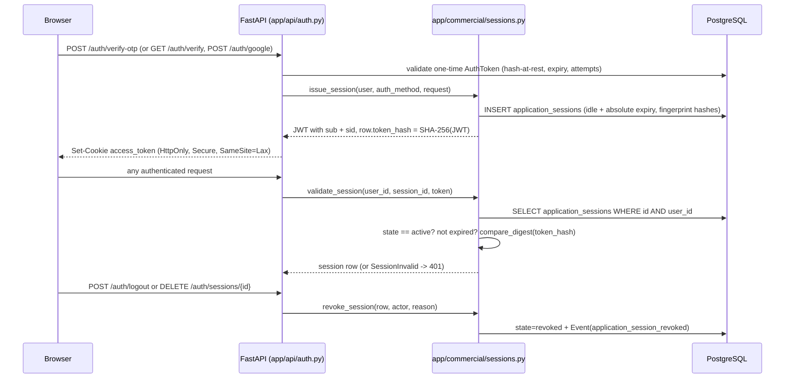

# Session and Revocation Model

Status: review-preparation document. It describes the implemented model with code citations so an external reviewer can verify each claim. It is not an assertion of independent verification, ASVS conformance, or completed penetration testing.

## Overview

Authentication uses a two-layer model: a signed JWT acts only as a transport token, and every production login is bound to a revocable server-side row in the `application_sessions` table. The JWT alone is never sufficient in production — `app/api/deps.py:get_current_user` requires the `sid` claim and validates the corresponding database row on every request, so revocation takes effect immediately without waiting for token expiry.

## Token structure

`app/core/security.py:create_access_token` signs a JWT with `JWT_SECRET` (HS256 via `JWT_ALGORITHM`; secret enforced ≥ 32 chars and placeholder-rejected by the validator in `app/core/config.py`). Claims:

| Claim | Content | Source |
|---|---|---|
| `sub` | user UUID | `app/core/security.py` line 29 |
| `iat` / `exp` | issue time / issue + `JWT_EXPIRY_DAYS` (default 30) | lines 30–31 |
| `ver` | token schema version, currently `2` | line 32 |
| `sid` | `application_sessions.id` the token is bound to | lines 34–35 |

The full encoded JWT is hashed (SHA-256) into `application_sessions.token_hash` at issue time (`app/commercial/sessions.py:issue_session`, lines 95–96), so the raw bearer credential is never stored. Validation compares hashes with `secrets.compare_digest` (`validate_session`, line 138), which also means a JWT with a valid signature but the wrong `sid` binding is rejected.

## Cookie

Set by `_set_auth_cookie` in `app/api/auth.py` (lines 311–320):

- name: `settings.SESSION_COOKIE_NAME` (default `access_token`)
- `HttpOnly=True`; `Secure` whenever `ENV != "development"`; `SameSite=Lax`
- `max_age` = `SESSION_ABSOLUTE_DAYS` (default 30 days)

Bearer `Authorization` headers are also accepted as a fallback (`app/api/deps.py:_extract_token`), primarily for tests and API clients.

Reviewer attention: the cookie does not use the `__Host-` prefix and logout's `delete_cookie` relies on default path/domain; SameSite is `Lax` rather than `Strict`. These are deliberate current choices, listed here so the review can assess them explicitly.

## Server-side session rows

Table `application_sessions` (`app/models/commercial.py`, `ApplicationSession`, lines 381–407):

| Column | Purpose |
|---|---|
| `token_hash` (unique) | SHA-256 of the full JWT; binds exactly one credential to the row |
| `device_label` | optional `X-Device-Name` header value, truncated to 200 chars |
| `user_agent_hash`, `ip_prefix_hash` | peppered SHA-256 fingerprints, never raw values (`_privacy_hash` uses `PRIVACY_HASH_PEPPER` falling back to `JWT_SECRET`; IPv4 truncated to /24, IPv6 to /56 before hashing — `app/commercial/sessions.py` lines 34–52) |
| `state` | `active` / `expired` / `revoked` |
| `auth_method` | `magic_link`, `email_otp`, `google` (or `test` in fixtures) |
| `idle_expires_at`, `absolute_expires_at` | dual expiry, see lifetimes |
| `reauthenticated_at` | drives the sensitive-action window |
| `revoked_at`, `revoked_by`, `revoke_reason` | revocation audit fields |

Session lifecycle transitions are additionally recorded in the `events` table with kinds `application_session_created`, `application_session_revoked`, and `application_session_reauthenticated` (`app/commercial/sessions.py`).

## Lifetimes (configuration settings)

All in `app/core/config.py`:

| Setting | Default | Effect |
|---|---|---|
| `SESSION_IDLE_MINUTES` | 720 (12 h) | `idle_expires_at`; renewed on activity at most every 5 minutes, capped at the absolute expiry (`validate_session` lines 140–144) |
| `SESSION_ABSOLUTE_DAYS` | 30 | `absolute_expires_at`; hard ceiling regardless of activity |
| `SESSION_REAUTH_MINUTES` | 15 | freshness window for sensitive admin actions |
| `JWT_EXPIRY_DAYS` | 30 | JWT `exp`; matches the absolute session lifetime |
| `MAGIC_LINK_EXPIRY_MINUTES` | 15 | one-time magic-link token lifetime |

Expired sessions are marked `state="expired"` lazily when next presented (`validate_session` lines 132–137); there is no background sweeper. Reviewer attention: lazy expiry means a never-again-presented session row stays `active` in the table even after its timestamps pass — enforcement is correct, but session listings should be read with the expiry columns.

## Login flows and one-time credentials

All three login paths end in `issue_session` and the same cookie:

1. Magic link: `POST /auth/request-link` stores only `sha256(raw_token)` in `auth_tokens.token_hash` (`app/core/security.py:generate_magic_link_token`), expiring after `MAGIC_LINK_EXPIRY_MINUTES` with a 3-minute re-request cooldown. `GET /auth/verify?token=...` enforces single use (`used_at`) and expiry (`app/api/auth.py` lines 206–231). Reviewer attention: the raw token travels in a GET query string; it is single-use and short-lived, but query-string exposure in intermediary logs is a known review topic.
2. Email OTP: `POST /auth/request-otp` generates a 6-digit code (`secrets.randbelow`), stored as `sha256("otp:{user_id}:{code}")` with a 10-minute expiry and 60-second cooldown. `POST /auth/verify-otp` allows at most 5 attempts per token (`attempts >= 5` lockout) and returns a uniform 401 "Invalid or expired code" for every failure mode (lines 134–171).
3. Google Sign-In: `POST /auth/google` verifies the credential via `app/services/google_auth.py:verify_google_credential` and rejects with a generic 401 on failure.

## Per-device revocation, revoke-all, admin revocation

Implemented in `app/api/commercial_sessions.py`:

| Route | Semantics |
|---|---|
| `GET /auth/sessions` | lists the caller's own sessions with a `current` marker; fingerprints only ever shown as device label |
| `DELETE /auth/sessions/{session_id}` | revokes one device; 404 (not 403) when the row belongs to another user; clears the cookie if the caller revoked their own current session |
| `POST /auth/sessions/revoke-all` | revokes every active session, optionally preserving the current one (`keep_current`); requires a reason (recorded in `revoke_reason` and the event log) |
| `POST /institutions/{institution_id}/members/{user_id}/revoke-sessions` | admin path; requires the `session.revoke_member` capability (institution_admin only, `app/collaboration/capabilities.py`) and recent reauthentication |

`revoke_all_sessions` (`app/commercial/sessions.py` lines 176–200) iterates only `state == "active"` rows and records the actor and reason on each.

Test evidence: `tests/test_phase5_api.py::test_user_can_revoke_all_device_sessions` proves that after revoke-all with `keep_current=false` the same cookie immediately receives 401 on `GET /auth/me`.

## Reauthentication window for sensitive actions

`require_recent_reauthentication` (`app/commercial/sessions.py` lines 203–214) raises 401 with header `X-Reauthentication-Required: true` when `reauthenticated_at` is older than `SESSION_REAUTH_MINUTES`. The window is refreshed only by `POST /auth/sessions/reauthenticate`, which consumes a fresh email OTP (same hash/attempt rules as login) and calls `mark_reauthenticated`.

Endpoints currently gated (verified by grep of `require_recent_reauthentication(current_session)`):

| Router | Gated actions |
|---|---|
| `app/api/commercial_billing.py` | create/revoke entitlement grants, replay billing events, set tenant budgets |
| `app/api/commercial_operations.py` | feature-flag updates, rollout assignments, recovery-policy creation |
| `app/api/commercial_privacy.py` | privacy lifecycle requests, notice creation, notice publishing |
| `app/api/commercial_reliability.py` | SLO definitions, security-evidence records |
| `app/api/commercial_sessions.py` | admin member-session revocation |

Test evidence: `tests/test_phase5_api.py::test_admin_can_grant_entitlement_after_recent_reauthentication` exercises the happy path (a freshly issued session has `reauthenticated_at = now`). Exercising the expired window is listed as manual evidence in `docs/phase5/security-verification-matrix.md` (Reauthentication row) and should be part of the external test plan.

## Logout semantics

`POST /auth/logout` (`app/api/auth.py` lines 234–266) revokes the server session referenced by the presented cookie (reason "User signed out from this device."), then deletes the cookie. It is deliberately idempotent and never reveals token validity: any decode or lookup failure is swallowed with a rollback and the response is `{"ok": true}` regardless. Logout without a valid cookie therefore succeeds silently.

## Per-request validation

`app/api/deps.py:get_current_user`:

- extracts the token from cookie or bearer header, decodes claims, maps signature/decode errors to generic 401s;
- requires the server session to validate when `sid` is present; in `ENV == "production"` a token without `sid` is rejected outright ("Sign in again to create a revocable session.", lines 71–74) — legacy `sid`-less cookies are tolerated only in development/staging for migration;
- refuses users whose `account_status` is not `active`.

`get_current_application_session` (`CurrentApplicationSession`) is the dependency used wherever the session row itself is needed (device listing, reauthentication checks).

## External-review token model

External reviewers never receive application sessions. Sealed submission packages are shared through `external_review_grants` (`app/models/institutional_governance.py`, `ExternalReviewGrant`, lines 196–223), a separate, narrower credential:

- Hash-at-rest: the token is `secrets.token_urlsafe(32)`; only `sha256(token)` is stored in the unique `token_hash` column (`app/collaboration/sealing.py:create_external_review_grant`). The raw token is returned exactly once at creation with an explicit notice that it is not logged (`app/api/submissions.py` lines 286–298).
- Expiry: `expires_at` is mandatory and must be in the future at creation; lookups filter `expires_at > now` and `status == "active"`.
- Recipient binding: every use requires the recipient email in the request body and compares it against `grant.recipient_email` with `secrets.compare_digest` (`app/api/external_downloads.py` lines 55–58, `app/api/submissions.py` lines 334–336). Token alone is insufficient.
- Permissions: subset of `{sealed.read_metadata, sealed.read_content, sealed.download}`; `sealed.download` additionally requires `download_allowed=true` (`app/collaboration/sealing.py` lines 350–355).
- Watermark: the `watermark` column is echoed in the access response and emitted as an `X-Robofox-Watermark` header on local file downloads (`app/api/external_downloads.py` lines 121–125), alongside the package checksum.
- Transport: tokens travel only in POST bodies (`POST /external-review/access`, `POST /external-review/download`), never in URL paths or query strings — stated as a design invariant in the module docstring of `app/api/external_downloads.py`.
- Revocation and audit: `DELETE /projects/{project_id}/external-review/{grant_id}` sets `revoked_at`/`revoked_by`; `last_accessed_at` and `access_count` record use.
- Failure opacity: every failure mode (bad token, wrong email, revoked, expired, unsealed package, non-final export) returns the same 404.

Download responses use a presigned R2 URL valid for 300 seconds, and only exports whose manifest state is `final` and that are listed in the sealed package's `export_ids` are reachable.

## Suggested reviewer focus

1. Offline brute-force of the 6-digit OTP hash (`sha256("otp:{user_id}:{code}")` is unsalted beyond the user ID; online attempts are capped at 5, but a database leak scenario is worth assessing).
2. JWT lifetime equal to the absolute session lifetime — acceptable because the server row is authoritative, but confirm no endpoint trusts the JWT without `validate_session`.
3. Cookie scoping (`__Host-`, SameSite level) and the magic-link token in the GET query string.
4. The development/staging tolerance for `sid`-less tokens (`app/api/deps.py` lines 71–74) — confirm staging used for the pentest sets `ENV=staging` and that the tolerance cannot leak into production configuration.
