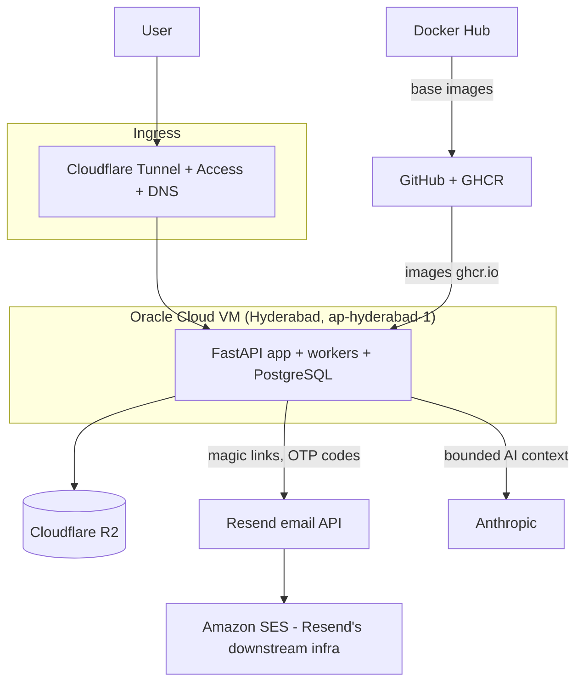

# Subprocessor Inventory — Review Preparation

Status: **review-preparation document**. This is the honest current inventory of third parties that process or can access platform data, compiled for the external security/privacy review. Contractual status is stated as known today; "not yet executed" means exactly that. No DPDP/GDPR adequacy or compliance conclusion is made here — that is listed as required external work in `docs/phase5/security-verification-matrix.md` ("Privacy/legal review of notices, retention, subprocessors and cross-border processing").

The runtime registry for this inventory is the `subprocessor_records` table (`app/models/commercial.py:787-801`, with `data_categories`, `processing_locations`, `contract_reference`); it should be seeded from this document once the review agrees the content.

## Data-flow overview

## Inventory

### 1. Cloudflare (ingress proxy + object storage)

| Aspect | Detail |
|---|---|
| Services used | Cloudflare Tunnel + Access as the only ingress (`SETUP-CLOUDFLARE-TUNNEL.md`: "No firewall ports opened on the VM. Cloudflare Tunnel is the only ingress"); DNS for `robofox.online`; R2 object storage (`STORAGE_BACKEND=r2` mandatory in production, `app/core/config.py:122-135`) |
| Data categories exposed | All HTTP traffic in plaintext at the Cloudflare edge (TLS terminates there): credentials-in-flight (magic-link tokens in callback URLs), manuscript uploads/downloads, AI conversation payloads. R2 persistently holds manuscript originals, previews, exports (key patterns in `app/api/manuscripts.py:154`, `app/services/preview_service.py:157`, `app/services/export_service.py:217`). Cloudflare Access additionally processes allow-listed operator emails |
| Region notes | Cloudflare is a global edge network; R2 bucket (`R2_BUCKET_NAME=thesis-studio`, `app/core/config.py:77`) has no jurisdiction/location hint configured. Data residency for Indian institutional customers is an open question for legal review |
| Contractual status | Self-serve terms of service only. **DPA not yet executed / not verified.** Cloudflare offers a standard self-serve DPA — signing/confirmation is an open action |

### 2. Resend (transactional email) — with Amazon SES downstream

| Aspect | Detail |
|---|---|
| Services used | HTTP API `https://api.resend.com/emails` (`app/services/email_service.py:18`), sender `thesis@robofox.online` (`EMAIL_FROM_ADDRESS`, `app/core/config.py:68`) |
| Data categories exposed | Recipient email addresses; raw magic-link sign-in URLs (`send_magic_link_email`, `app/services/email_service.py:21-59`) and 6-digit OTP codes in subject and body (`send_otp_email`, lines 98-136). These are live authentication secrets while valid (15 min links / 10 min OTPs) |
| Downstream infrastructure | Resend publicly delivers via Amazon SES. Amazon/AWS is therefore a **sub-subprocessor** for email content. We have no direct AWS relationship; flow-down obligations depend entirely on Resend's terms — verify during review |
| Region notes | Resend is US-based; processing region is not contractually pinned by us. Email content should be assumed to transit US infrastructure |
| Contractual status | Self-serve API terms. **DPA not yet executed / not verified** |

### 3. Anthropic (AI provider) — pilot vs governed paths

Two distinct integration modes exist and carry different contractual weight:

| Aspect | Pilot path (current) | Governed path (built, to be configured) |
|---|---|---|
| Mechanism | Claude Code CLI subprocess authenticated with a Max-subscription OAuth login (`CLAUDE.md` "Auth: Claude Code CLI subprocess with Max OAuth"; route slug `legacy-claude-cli`, adapter `claude_cli`, reported as `state: "pilot_only"` in `app/commercial/ai_capacity.py:123-136, 218-233`) | `ai_providers` rows with `adapter`, `credential_reference` (env:/file: secret references, per `docs/phase5/security-verification-matrix.md` Secrets row), per-institution scoping, `data_handling` JSONB, model routes and concurrency limits (`app/models/commercial.py:410-435`), circuit-breaker health (`ai_provider_health`) |
| Terms basis | Consumer subscription terms of the Max plan — **not** a commercial data-processing agreement. Not an appropriate basis for institutional commitments about training-use, retention, or confidentiality | Anthropic API commercial terms once an API-key provider is configured; `data_handling` is the slot for recording the agreed posture per provider |
| Data categories exposed | Selected scope of manuscript content, quotations included in bounded context, student prompts and AI outputs ("AI requests include only selected scope, required summaries/evidence and applicable policy" — `docs/phase5/data-map.md`, minimisation rule 2). Staging/production never receive the synthetic in-process route (`app/commercial/ai_capacity.py:123-127`) | Same categories, but contractually governed and per-institution disableable (`docs/runbooks/support-operations.md`: "Disable AI or reduce a tenant budget") |
| Region notes | Anthropic processes in the US; no region pinning either way | Same; record in `ai_providers.data_handling` when known |
| Contractual status | Consumer terms only. **DPA not executed; pilot posture must be disclosed to pilot institutions** | **Not yet executed** — blocking item before institutional/governed rollout |

### 4. Oracle Cloud (hosting)

| Aspect | Detail |
|---|---|
| Services used | Ubuntu 22.04 VM, public IP `68.233.116.11`, Hyderabad region (`ap-hyderabad-1`) — `SETUP-CLOUDFLARE-TUNNEL.md`, `CLAUDE.md` deployment target |
| Data categories exposed | Everything: PostgreSQL data files (all inventory classes in `docs/security/DATA_INVENTORY.md`), process memory, logs on disk. Oracle personnel access is governed by Oracle's cloud terms |
| Region notes | India (Hyderabad) — favorable default for Indian institutional customers; keep backups' region consistent when off-host backup target is chosen |
| Contractual status | Oracle Cloud self-serve agreement. **DPA/data-processing terms not separately executed or verified.** Note: the target topology requires PostgreSQL off the app host and no host-sharing with unrelated Robofox apps (`docs/phase5/production-topology.md`, Required production boundaries 1 and 5); the current pilot VM violates both — an accepted, documented interim state, not an unknown |

### 5. GitHub (code hosting + CI) and GHCR (images)

| Aspect | Detail |
|---|---|
| Services used | Repository hosting; GitHub Actions CI (`.github/workflows/phase1-ci.yml` … `phase5-release.yml`, `phase5-security.yml`); GHCR image registry — release images pushed to `ghcr.io/<repository>:<sha>` (`.github/workflows/phase5-release.yml:87, 100`) |
| Data categories exposed | Source code, CI logs, dependency/security scan output (pip-audit, Bandit per `phase5-security.yml`), release attestations (`release-candidates/<sha>.json`), Actions secrets (deploy credentials). **No student personal data by policy** — `.env` is git-ignored and log/CI content is metadata; the review should sample CI logs to confirm |
| Region notes | US-based (Microsoft). Code, not personal data |
| Contractual status | GitHub standard terms. **DPA not separately executed / not verified** |

### 6. Docker Hub (upstream base images)

| Aspect | Detail |
|---|---|
| Services used | Pull-only, at build time: `python:3.11-slim-bookworm` (`Dockerfile.phase5:1`); dev-only `postgres:16-alpine` (`docker-compose.yml:5,22`). Runtime images are pinned to immutable references (`deploy/compose.phase5.yml:4,30` require digest-pinned `ROBOFOX_IMAGE`/`CLAMAV_IMAGE`; `docs/phase5/production-topology.md`, boundary 10) |
| Data categories exposed | None — no platform or personal data flows to Docker Hub. Exposure is supply-chain risk (malicious/compromised base image), mitigated by digest pinning and the CI security workflow |
| Region notes | Not applicable (no data outbound) |
| Contractual status | Anonymous/free-tier pulls. No contract needed for data protection; supply-chain policy is the relevant control |

## Not subprocessors (for clarity)

ClamAV runs as a **self-hosted internal service** (`CLAMAV_HOST=clamav`, `app/core/config.py:82`; private, health-checked per `docs/phase5/production-topology.md` boundary 9) — no third party receives upload content for scanning. The billing provider is `BILLING_PROVIDER=manual` today (`app/core/config.py:62`); when an online payment provider is configured, it must be added here before go-live of paid subscriptions.

## Actions before institutional claims

1. Execute or verify DPAs: Cloudflare, Resend (with SES flow-down confirmation), Anthropic (governed API), Oracle, GitHub.
2. Seed `subprocessor_records` from this inventory and set `contract_reference`, `processing_locations`, `reviewed_at` per row.
3. Decide and document the pilot-AI disclosure text shown to pilot institutions (`institutions.ai_disclosure_text` field exists, `app/models/institution.py:37`).
4. Legal review of cross-border transfer posture (India-hosted data, US-processing email/AI) — required external work per `docs/phase5/security-verification-matrix.md`.
