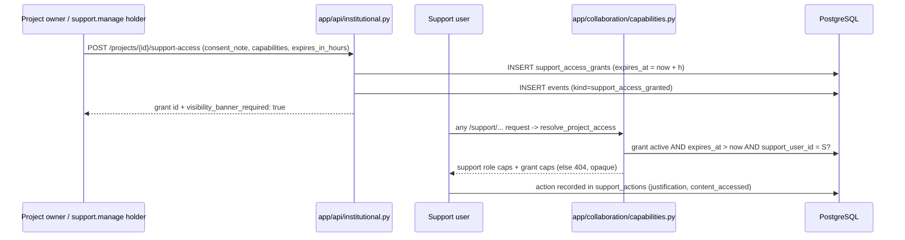

# Support Access Controls

Status: review-preparation document. It consolidates the support-access design for an external security review, citing the enforcing code. It complements (does not replace) `docs/runbooks/support-operations.md`, which is the operational procedure.

## Principle: metadata-only by default

Support resolves operational failures without default access to thesis content (`docs/runbooks/support-operations.md`). This is enforced in code, not just policy:

- The `support` role's baseline capability set contains no content capabilities: `project.read_metadata`, `support.console`, `support.retry_job`, `support.diagnostic`, `session.revoke_support`, `reliability.read` (`app/collaboration/capabilities.py`, `ROLE_CAPABILITIES["support"]`, lines 60–64).
- A support user has no standing access to any project. Access exists only while a time-boxed `support_access_grants` row is active for that specific project and that specific support user.
- The diagnostic tooling is structurally incapable of returning manuscript text (see "Diagnostic bundle" below).

## The grant: `support_access_grants`

Model `SupportAccessGrant` in `app/models/tenancy.py` (lines 262–282):

| Column | Control it implements |
|---|---|
| `project_id`, `support_user_id` | grant is per-project and per-named-person; no group or wildcard grants exist |
| `granted_by` | accountability for who consented |
| `capabilities` (JSONB) | additional capabilities beyond the support baseline |
| `consent_note` (required, NOT NULL) | recorded consent text |
| `status`, `expires_at` (NOT NULL), `revoked_at` | time-boxing and revocation |

Creation endpoint: `POST /projects/{project_id}/support-access` (`app/api/institutional.py` lines 322–338). Controls at the API boundary:

- Only the project owner (student) or a holder of `support.manage` (institution_admin) can grant; anyone else gets an opaque 404 (line 330–331).
- Grantable capabilities are a closed allowlist — `Literal["project.read_metadata", "project.read_content", "project.read_sources"]` with default `["project.read_metadata"]` (`SupportGrantCreate`, lines 88–92). Editing, approval, or AI-history capabilities cannot be granted through this endpoint at all.
- `consent_note` is required (5–8000 chars); `expires_in_hours` is bounded to 1–72 with a default of 4 hours.
- Creation writes an `events` row (`kind="support_access_granted"`) with the grant id, support user, capabilities, and expiry, and the response carries `visibility_banner_required: true` so the client must show a persistent support-access banner (runbook step 7).

## Enforcement: capability resolution

`app/collaboration/capabilities.py:resolve_project_access` (lines 190–212) is the single resolution path. For a support user it selects a grant only when `status == "active"` and `expires_at > now`, then unions the support baseline with the grant's capabilities. Content flags are derived, not assumed: `content_access` is true only if the grant explicitly carries `project.read_content` (same for sources and AI history). Expired or revoked grants simply resolve to no access, and `require_project_capability` (lines 216–227) converts that into a 404 — support users cannot even confirm a project exists once a grant lapses.

Time-boxing is therefore enforced at query time on every request; no revocation job is needed for enforcement (though rows are not garbage-collected — see review focus).

## What support can do

Support console routes (`app/api/support_console.py`) — both demand a written justification (10–4000 chars):

| Route | Capability | Effect |
|---|---|---|
| `POST /support/projects/{project_id}/diagnostic-bundle` | `support.diagnostic` | metadata-only diagnostic bundle |
| `POST /support/projects/{project_id}/jobs/{job_id}/retry` | `support.retry_job` | re-queue a failed/cancelled idempotent job |

`retry_job` (`app/commercial/support.py` lines 158–191) refuses any job not in `failed` or `cancelled` state, so support cannot re-run succeeded work or preempt running jobs.

### Diagnostic bundle is metadata-only by construction

`diagnostic_bundle` (`app/commercial/support.py` lines 26–155) returns project workflow state, job queue state (with `error_class_present` as a boolean instead of the error text), export/preview/revision checksums and sizes, and AI run counts by status. It selects no manuscript, source, quote, or AI message content, and the bundle self-declares this in a `privacy` block (`manuscript_content_included: false`, etc., lines 135–140) so a reviewer can assert on it in tests.

## Prohibited actions

From `docs/runbooks/support-operations.md`, support must not by default: read thesis chapters, sources, quotations or private AI conversations; modify academic prose; approve academic, formatting or submission decisions; change institutional policies; bypass billing or retention controls via direct database access; or represent workflow approvals as legal signatures. The code backs the first three: no content capability is in the support baseline, no editing capability is grantable through `SupportGrantCreate`, and approval capabilities (`project.approve_*`) belong only to supervisor/operator roles in `ROLE_CAPABILITIES`. The database-access and policy prohibitions are operational controls (single-operator deployment) and should be examined as such in the review.

## Audit trail

Two complementary records:

1. `support_actions` table (`app/models/commercial.py`, `SupportAction`, lines 829–852): every console action writes `support_user_id`, `institution_id`/`project_id`, `action` (`generate_diagnostic_bundle`, `retry_failed_job`), the free-text `justification`, a `content_accessed` boolean (currently always `false` for console actions), an optional `consent_reference`, a result summary, and the `release_sha` of the running build. Indexed by scope and time (`ix_support_actions_scope_time`).
2. `events` table: `support_access_granted` on grant creation (`app/api/institutional.py` line 336) plus the session events described in `docs/security/SESSION_MODEL.md`.

The security-verification matrix commits to a quarterly support-access review as manual evidence (`docs/phase5/security-verification-matrix.md`, "Support access" row).

## Suggested reviewer focus

1. Grant-revocation surface: expiry is enforced at resolution time, but confirm the product path for early revocation of a grant (setting `status`/`revoked_at`) is exposed and permission-checked; the model supports it, and the reviewer should verify the operative endpoint.
2. Escalation via `capabilities` JSONB: the API allowlist restricts grantable capabilities to three read scopes, but `resolve_project_access` unions whatever the row contains — direct DB writes could grant more. Assess whether that residual (single-operator DB access) matches the runbook's prohibition on direct database bypasses.
3. `content_accessed` on `support_actions` is hardcoded `false` for the two console actions because they cannot access content; if content-scoped grants (`project.read_content`) are used through other read endpoints, verify those reads are attributable (they route through the ordinary project endpoints and `events`, not `support_actions`).
4. Confirm the frontend actually renders the persistent banner keyed by `visibility_banner_required` (backend can only signal it).
